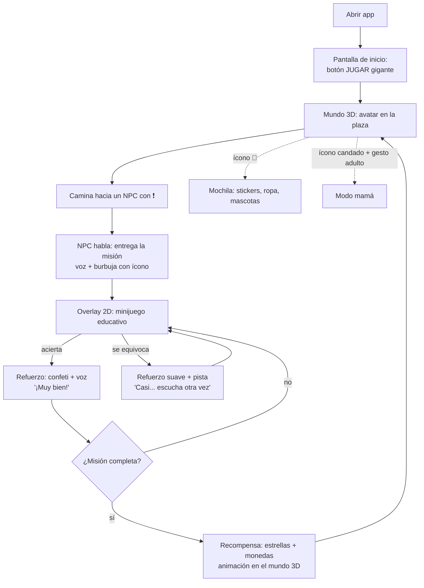

# Villa Amparo — Arquitectura del Proyecto

## 1. Principio arquitectónico central

El juego tiene **dos capas visuales independientes**:

1. **Capa mundo (3D):** el pueblo, el avatar, los NPCs, la exploración. Es React
   Three Fiber. Su única responsabilidad educativa es *llevar a la niña hasta una
   misión* y *celebrar cuando la completa*.
2. **Capa misión (2D):** overlays a pantalla completa con las actividades de
   lectoescritura. HTML/CSS puro: letras enormes, botones táctiles grandes,
   arrastrar y soltar. Aquí NO hay 3D.

Ambas capas se comunican solo a través del store global (Zustand). Esto permite:
- Desarrollar y probar minijuegos sin cargar el mundo 3D.
- Que el modo mamá y el sistema de progreso no sepan nada del 3D.
- Rendimiento: el canvas 3D se pausa mientras un minijuego está abierto.

## 2. Estructura de carpetas

```
villa-amparo/
├── public/
│   ├── audio/              # SFX y frases pre-grabadas de personajes
│   └── icons/              # Íconos PWA
├── src/
│   ├── app/                # Shell: router de pantallas, PWA, orientación
│   │   ├── App.tsx
│   │   └── screens.ts      # 'home' | 'world' | 'mission' | 'parent' | 'rewards'
│   │
│   ├── world/              # ── CAPA 3D ──
│   │   ├── World.tsx       # Canvas R3F + escena
│   │   ├── map/            # Terreno, casas, decoración (componentes por zona)
│   │   ├── avatar/         # Avatar, animaciones, personalización
│   │   ├── npcs/           # NPCs: modelo, diálogo, indicador de misión (!)
│   │   └── controls/       # Joystick virtual táctil + cámara que sigue
│   │
│   ├── missions/           # ── CAPA 2D EDUCATIVA ──
│   │   ├── MissionHost.tsx # Overlay que monta el minijuego activo
│   │   ├── engine/         # Selección de contenido, dificultad adaptativa, scoring
│   │   └── games/          # Un componente por tipo de minijuego
│   │       ├── CazaLetras.tsx        # reconocer letras
│   │       ├── FabricaSilabas.tsx    # formar sílabas
│   │       ├── ParejasPalabras.tsx   # unir palabra con imagen
│   │       ├── PalabraIncompleta.tsx # completar palabras
│   │       ├── LeoLaFrase.tsx        # leer frases cortas
│   │       ├── CopiaPalabras.tsx     # copiar palabras
│   │       ├── LetrasRevueltas.tsx   # ordenar letras
│   │       └── Respondeme.tsx        # escribir respuesta simple
│   │
│   ├── content/            # ── CONTENIDO PEDAGÓGICO (datos, no código) ──
│   │   ├── letters.ts      # Orden de introducción de letras
│   │   ├── syllables.ts    # Sílabas por nivel
│   │   ├── words.json      # Banco de palabras: texto, sílabas, emoji/imagen, nivel
│   │   ├── phrases.json    # Frases cortas por nivel
│   │   └── dialogs.ts      # Diálogos de NPCs (texto + audio)
│   │
│   ├── voice/              # TTS: cola de locuciones, voz por personaje,
│   │   └── speak.ts        # botón "escuchar de nuevo" universal
│   │
│   ├── progress/           # Modelo de datos + persistencia (ver 04-modelo-de-datos.md)
│   │   ├── store.ts        # Zustand store global
│   │   ├── persistence.ts  # localStorage/IndexedDB detrás de una interfaz
│   │   └── adaptive.ts     # Lógica de subir/bajar dificultad
│   │
│   ├── rewards/            # Estrellas, monedas, stickers, inventario, tienda
│   │
│   ├── parent/             # Modo mamá: dashboard, palabras nuevas, errores
│   │
│   └── ui/                 # Componentes compartidos: BotónGrande, LetraGigante,
│                           # barra de estrellas, confeti, botón de audio 🔊
├── docs/                   # Estos documentos de diseño
└── package.json
```

## 3. Flujo de una sesión de juego



## 4. Sistema de voz

Toda la interfaz es operable sin saber leer:

- **`speak(texto, personaje?)`**: función única para todo el juego. Encola
  locuciones (nunca se pisan entre sí), ajusta tono/velocidad por personaje
  (el búho habla lento y grave, la rana rápido y agudo) con los parámetros
  `pitch`/`rate` de `speechSynthesis`.
- **Regla de oro:** todo texto visible tiene un botón 🔊 al lado, y toda
  instrucción se lee en voz alta automáticamente al aparecer.
- **Audio pre-grabado** para frases fijas de personajes (saludos, celebraciones):
  más carisma que TTS. TTS se reserva para contenido dinámico (palabras que
  agrega la mamá, instrucciones generadas).
- **Refuerzo positivo variado:** pool de ~15 frases de celebración para que no
  se repita siempre la misma.

## 5. Controles táctiles (niña de 6 años)

- **Joystick virtual** en la mitad izquierda de la pantalla (aparece donde pone
  el dedo — no hay que apuntarle a un círculo pequeño).
- **Sin botón de saltar en el MVP** (no es necesario para las misiones; se puede
  agregar como juguete en Fase 2).
- **Interacción con NPCs por proximidad:** al acercarse, aparece un botón gigante
  "HABLAR 💬" — o directamente el NPC saluda solo.
- **Cámara automática** (tercera persona, sigue al avatar). Nada de controlar
  cámara con segundo dedo.
- **Landscape bloqueado**, elementos interactivos de mínimo 80×80 px.

## 6. Decisiones técnicas clave

| Decisión | Elección | Razón |
|---|---|---|
| Modelos 3D | Primitivas de Three.js (cajas, cilindros, esferas) con paleta de colores alegre; opcionalmente assets gratuitos de Kenney.nl (CC0) | Cero costo, estética low-poly coherente, archivos pequeños |
| Imágenes de palabras | Emoji gigantes como primera opción (🐱 🏠 🌞) | Gratis, universales, cero assets que producir; reemplazables por ilustraciones después |
| Estado global | Zustand con middleware `persist` | El progreso se guarda solo, en cada cambio |
| Offline | PWA con service worker (vite-plugin-pwa) | El juego funciona sin internet después de la primera carga |
| Física | Ninguna librería de física en MVP; colisiones simples por distancia | Un obby educativo no necesita física real; menos peso y menos bugs |
